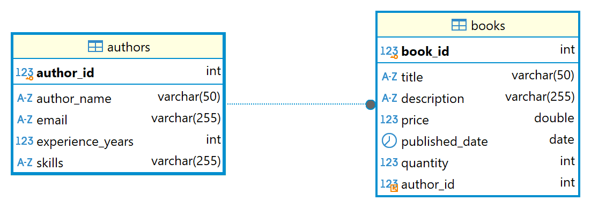

# Quản lý Sách và Tác Giả

## 1. Đề Bài

Sơ đồ ERD (Entity Relationship Diagram) cho hệ thống quản lý Sách và Tác Giả:

### 1.1 Xây dựng Entity Class cho Tác Giả (Author) và Sách (Book)

Author:

- `authorId (int)`: Khóa chính, tự động tăng.

- `authorName (String)`: Họ tên của tác giả (từ 6 đến 50 ký tự). Không được để trống.

- `totalExperienceYears (int)`: Số năm kinh nghiệm của tác giả (lớn hơn hoặc bằng 0). Không được để trống.

- `skills (String)`: Kỹ năng của tác giả (không bắt buộc).

- `email (String)`: Địa chỉ email của tác giả (nếu có, phải hợp lệ).

- `bookList (List<Book>)`: Mối quan hệ 1 - nhiều với Book

Book:

- `bookId (int)`: Khóa chính, tự động tăng.

- `title (String)`: Tiêu đề của cuốn sách (từ 3 đến 100 ký tự). Không được để trống.

- `description (String)`: Mô tả về sách (không bắt buộc).

- `price (double)`: Giá bán của sách (lớn hơn hoặc bằng 0).

- `quantity (int)`: Số lượng sách (lớn hơn hoặc bằng 0).

- `publishedDate (LocalDate)`: Ngày xuất bản (phải là ngày trong quá khứ hoặc hiện tại).

- `author (Author)`: Liên kết với tác giả, không thể null.

### 1.2 Mối quan hệ giữa Author và Book

- Một tác giả có thể có nhiều cuốn sách (OneToMany).

- Một cuốn sách phải có một tác giả (ManyToOne).

## 2. Yêu Cầu

### 2.1 Mapping Entity

Mapping các thuộc tính trong entity class tương ứng với các cột trong bảng.

Sử dụng annotation để định nghĩa các quan hệ (1 - nhiều) giữa Author và Book.

### 2.2 Validation

Sử dụng các annotation validation như @NotNull, @Size, @Min, @Email, @PastOrPresent, @DecimalMin... để kiểm tra tính hợp lệ của các trường dữ liệu.

Xử lý các lỗi validation và hiển thị thông báo lỗi thích hợp cho người dùng.

### 2.3 CRUD

Viết các phương thức cơ bản cho phép thêm, sửa, xoá cho tác giả và sách.

Hiển thị danh sách tất cả, tìm kiếm theo ID cho tác giả và sách.

Viết phương thức trong main() thêm ít nhất 3 tác giả và 3 cuốn sách.

### 2.4 Query

#### 2.4.1 List<Book> findAllBookByName(String name)

Viết phương thức tìm kiếm sách theo tên sách

#### 2.4.2 List<Book> findAllBookByAuthorName(String authorName)

Viết phương thức tìm kiếm sách theo tên tác giả và sắp xếp theo tiêu đề (title) sách tăng dần

#### 2.4.3 List<Book> findAllBookByYear(int year)

Viết phương thức tìm kiếm các cuốn sách dựa vào năm xuất bản (ví dụ năm 2024)

#### 2.4.4 List<BookCountDTO> findBookCountByAuthor()

Viết phương thức tính số lượng sách của mỗi tác giả đã viết (tức là đếm số lượng các sách liên kết với mỗi tác giả)

| **AuthorName** | **BookCount** |
|----------------|-------------------------------|
| Duong          | 5                             |
| Min            | 3                             |

#### 2.4.5 List<BookCountDTO> findTotalQuantityBooksByAuthor()

Viết phương thức tính tổng số lượng sách của mỗi tác giả đã bán (tức là đếm số lượng sách dựa trên thuộc tính `quantity`)

| **AuthorName** | **TotalQuantity** |
|----------------|------------------------------------------------|
| Duong          | 100                                            |
| Min            | 75                                             |

#### 2.4.6 long findTotalQuantityBooksByAuthorId(int authorId)

Viết phương thức tính tổng số lượng sách theo tác giả (dựa trên mã tác giả), chỉ trả về tổng số lượng sách mà mỗi tác giả đã viết (tức là đếm số lượng các sách liên kết với mỗi tác giả).

#### 2.4.7 List<Book> findBooksWithZeroPriceOrZeroQuantity()

Viết phương thức để tìm các cuốn sách có `giá = 0` hoặc `số lượng = 0`

#### 2.4.8 List<Author> findAuthorsWithoutBooks()

Viết phương thức để tìm các tác giả chưa viết bất kì quyển sách nào.

#### 2.4.9 List<Book> findBooksByPriceRange(double minPrice, double maxPrice)

Viết phương thức để lọc sách có giá nằm trong khoảng cụ thể.

#### 2.4.10 List<Author> findTop3AuthorsWithMostBooks()

Viết phương thức tìm 3 tác giả viết nhiều sách nhất.

## 3. Result

### 3.1 Sơ đồ ERD (Entity Relationship Diagram) cho hệ thống quản lý Sách và Tác Giả sau khi run App:

### 3.2 Data của 2 bảng Authors, Books trước và sau khi chay test case

#### Bảng authors trước khi chạy test case:

<table><tr><th colspan="5"><pre><code>authors</code></pre></th></tr><tr><th>author_id</th><th>author_name</th><th>email</th><th>experience_years</th><th>skills</th></tr><tr class="odd"><td>1</td><td>Nguyễn Nhật Ánh</td><td>nguyen.nhat.anh@example.com</td><td>30</td><td>Văn học thiếu nhi, truyện dài</td></tr>
<tr><td>2</td><td>Nam Cao</td><td>nam.cao@example.com</td><td>40</td><td>Truyện ngắn, tiểu thuyết</td></tr>
<tr class="odd"><td>3</td><td>Ngô Tất Tố</td><td>ngo.tat.to@example.com</td><td>35</td><td>Hiện thực phê phán</td></tr>
</table>

#### Bảng authors sau khi chạy test case:

<table><tr><th colspan="5"><pre><code>authors</code></pre></th></tr><tr><th>author_id</th><th>author_name</th><th>email</th><th>experience_years</th><th>skills</th></tr><tr class="odd"><td>1</td><td>Nguyễn Nhật Ánh</td><td>nguyen.nhat.anh@example.com</td><td>30</td><td>Văn học thiếu nhi, truyện dài</td></tr>
<tr><td>2</td><td>Nam Cao</td><td>nam.cao@example.com</td><td>40</td><td>Truyện ngắn, tiểu thuyết</td></tr>
<tr class="odd"><td>3</td><td>Ngô Tất Tố</td><td>ngo.tat.to@example.com</td><td>35</td><td>Hiện thực phê phán</td></tr>
<tr><td>4</td><td>Dang Trung</td><td>trungdangdev@example.com</td><td>8</td><td>Java, Spring, Hibernate</td></tr>
</table>

#### Bảng books trước khi chạy test case:

<table><tr><th colspan="7"><pre><code>books</code></pre></th></tr><tr><th>book_id</th><th>title</th><th>description</th><th>price</th><th>published_date</th><th>quantity</th><th>author_id</th></tr><tr class="odd"><td>1</td><td>Tôi Thấy Hoa Vàng Trên Cỏ Xanh</td><td>Một câu chuyện về tuổi thơ và những giấc mơ</td><td>120,000</td><td>2010-05-20</td><td>50</td><td>1</td></tr>
<tr><td>2</td><td>Chí Phèo</td><td>Tác phẩm hiện thực phê phán nổi tiếng</td><td>80,000</td><td>1941-01-01</td><td>30</td><td>2</td></tr>
<tr class="odd"><td>3</td><td>Tắt Đèn</td><td>Cuộc sống khốn khổ của người nông dân Việt Nam trước cách mạng</td><td>95,000</td><td>1939-07-15</td><td>40</td><td>3</td></tr>
<tr><td>4</td><td>Cô Gái Đến Từ Hôm Qua</td><td>Câu chuyện tình yêu tuổi học trò</td><td>100,000</td><td>1990-06-10</td><td>45</td><td>1</td></tr>
<tr class="odd"><td>5</td><td>Lão Hạc</td><td>Truyện ngắn xúc động về số phận con người</td><td>75,000</td><td>1943-03-05</td><td>35</td><td>2</td></tr>
<tr><td>6</td><td>Việt Nam Văn Học Sử Yếu</td><td>Tác phẩm phê bình văn học nổi bật</td><td>150,000</td><td>1942-09-08</td><td>20</td><td>3</td></tr>
<tr class="odd"><td>7</td><td>Mắt Biếc</td><td>Một chuyện tình buồn đẫm nước mắt</td><td>130,000</td><td>1990-11-12</td><td>55</td><td>1</td></tr>
<tr><td>8</td><td>Sống Mòn</td><td>Tâm lý xã hội dưới chế độ phong kiến</td><td>89,000</td><td>1944-05-20</td><td>25</td><td>2</td></tr>
<tr class="odd"><td>9</td><td>Lều Chõng</td><td>Tái hiện cuộc sống sĩ tử thời phong kiến</td><td>140,000</td><td>1941-02-14</td><td>30</td><td>3</td></tr>
<tr><td>10</td><td>Bắt Trẻ Đồng Xanh</td><td>Tác phẩm văn học kinh điển về tâm lý tuổi trẻ</td><td>135,000</td><td>1951-07-16</td><td>40</td><td>2</td></tr>
<tr class="odd"><td>11</td><td>Quê Hương Yêu Dấu</td><td>Câu chuyện về cuộc sống thôn quê</td><td>110,000</td><td>1985-03-22</td><td>38</td><td>1</td></tr>
</table>

#### Bảng books sau khi chạy test case:

<table><tr><th colspan="7"><pre><code>books</code></pre></th></tr><tr><th>book_id</th><th>title</th><th>description</th><th>price</th><th>published_date</th><th>quantity</th><th>author_id</th></tr><tr class="odd"><td>2</td><td>Chí Phèo</td><td>Tác phẩm hiện thực phê phán nổi tiếng</td><td>80,000</td><td>1941-01-01</td><td>30</td><td>2</td></tr>
<tr><td>3</td><td>Tắt Đèn</td><td>Cuộc sống khốn khổ của người nông dân Việt Nam trước cách mạng</td><td>95,000</td><td>1939-07-15</td><td>40</td><td>3</td></tr>
<tr class="odd"><td>4</td><td>Cô Gái Đến Từ Hôm Qua</td><td>Câu chuyện tình yêu tuổi học trò</td><td>100,000</td><td>1990-06-10</td><td>45</td><td>1</td></tr>
<tr><td>5</td><td>Lão Hạc</td><td>Truyện ngắn xúc động về số phận con người</td><td>75,000</td><td>1943-03-05</td><td>35</td><td>2</td></tr>
<tr class="odd"><td>6</td><td>Việt Nam Văn Học Sử Yếu</td><td>Tác phẩm phê bình văn học nổi bật</td><td>150,000</td><td>1942-09-08</td><td>20</td><td>3</td></tr>
<tr><td>7</td><td>Mắt Biếc</td><td>Một chuyện tình buồn đẫm nước mắt</td><td>130,000</td><td>1990-11-12</td><td>55</td><td>1</td></tr>
<tr class="odd"><td>8</td><td>Sống Mòn</td><td>Tâm lý xã hội dưới chế độ phong kiến</td><td>89,000</td><td>1944-05-20</td><td>25</td><td>2</td></tr>
<tr><td>9</td><td>Lều Chõng</td><td>Tái hiện cuộc sống sĩ tử thời phong kiến</td><td>140,000</td><td>1941-02-14</td><td>30</td><td>3</td></tr>
<tr class="odd"><td>10</td><td>Bắt Trẻ Đồng Xanh</td><td>Tác phẩm văn học kinh điển về tâm lý tuổi trẻ</td><td>135,000</td><td>1951-07-16</td><td>40</td><td>2</td></tr>
<tr><td>11</td><td>Quê Hương Yêu Dấu</td><td>Câu chuyện về cuộc sống thôn quê</td><td>110,000</td><td>1985-03-22</td><td>38</td><td>1</td></tr>
<tr class="odd"><td>12</td><td>Lập Trình Java</td><td>&nbsp;</td><td>300</td><td>2023-01-01</td><td>10</td><td>4</td></tr>
</table>

....(to updating)